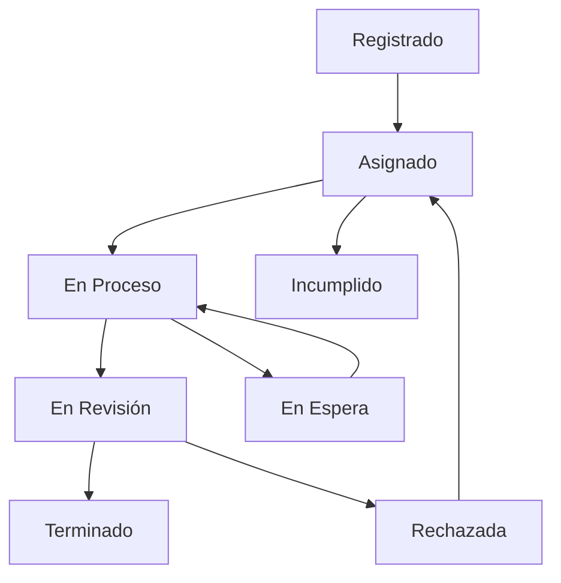
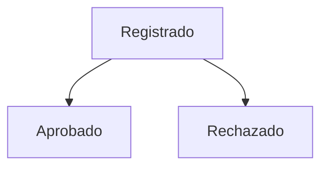

# Manual Técnico - Sistema IntelTask

## Versión 1.0 - Documentación para Desarrolladores y Administradores

---

## Tabla de Contenidos

1. [Arquitectura del Sistema](#arquitectura-del-sistema)
2. [Estructura del Proyecto](#estructura-del-proyecto)
3. [Tecnologías Utilizadas](#tecnologías-utilizadas)
4. [Base de Datos](#base-de-datos)
5. [API y Servicios](#api-y-servicios)
6. [Flujos de Trabajo](#flujos-de-trabajo)
7. [Sistema de Permisos](#sistema-de-permisos)
8. [Configuración](#configuración)
9. [Deployment](#deployment)
10. [Mantenimiento](#mantenimiento)

---

## Arquitectura del Sistema

### Arquitectura General

```
┌─────────────────┐    ┌─────────────────┐    ┌─────────────────┐
│   Frontend      │    │   Backend       │    │   Base de      │
│   (Next.js)     │◄──►│   (.NET Core)   │◄──►│   Datos        │
│                 │    │                 │    │   (SQL Server) │
└─────────────────┘    └─────────────────┘    └─────────────────┘
         │                       │                       │
         ▼                       ▼                       ▼
┌─────────────────┐    ┌─────────────────┐    ┌─────────────────┐
│   UI/UX         │    │   API REST      │    │   Entidades     │
│   Components    │    │   Controllers   │    │   Relaciones    │
└─────────────────┘    └─────────────────┘    └─────────────────┘
```

### Componentes Principales

#### Frontend (React/Next.js)
- **Framework**: Next.js 15.x
- **UI Library**: HeroUI (Componentes React)
- **Estado**: React Hooks + Context API
- **Autenticación**: NextAuth.js
- **Styling**: Tailwind CSS
- **Iconos**: React Icons

#### Backend (.NET Core)
- **Framework**: ASP.NET Core Web API
- **ORM**: Entity Framework Core
- **Autenticación**: JWT Tokens
- **Documentación**: Swagger/OpenAPI
- **Logging**: ILogger integrado

#### Base de Datos
- **Motor**: SQL Server
- **Patrón**: Database First / Code First
- **Migraciones**: Entity Framework Migrations

---

## Estructura del Proyecto

### Frontend (/frontend)

```
frontend/
├── components/           # Componentes React
│   ├── Layout/          # Componentes de layout
│   ├── Tareas/          # Módulo de tareas
│   ├── Permisos/        # Módulo de permisos
│   ├── icons/           # Iconos personalizados
│   └── utils/           # Utilidades y helpers
├── pages/               # Páginas de Next.js
│   ├── api/            # API routes de Next.js
│   ├── auth/           # Páginas de autenticación
│   └── _app.js         # Configuración global
├── services/            # Servicios de API
├── hooks/               # Custom React hooks
├── styles/              # Estilos globales
├── utils/               # Utilidades generales
└── public/              # Archivos estáticos
```

### Backend (/backend)

```
backend/
├── IntelTask.API/       # Proyecto principal de API
│   ├── Controllers/     # Controladores REST
│   ├── Properties/      # Configuraciones
│   └── uploads/         # Archivos subidos
├── IntelTask.Domain/    # Lógica de dominio
│   ├── Entities/        # Entidades del dominio
│   ├── DTOs/           # Data Transfer Objects
│   ├── Interfaces/      # Contratos e interfaces
│   └── Configuration/   # Configuraciones
└── IntelTask.Infrastructure/ # Infraestructura
    ├── Context/         # DbContext
    ├── Repositories/    # Repositorios
    └── Services/        # Servicios de infraestructura
```

---

## Tecnologías Utilizadas

### Frontend Stack

| Tecnología | Versión | Propósito |
|------------|---------|-----------|
| Next.js | 15.2.4 | Framework React |
| React | 18 | Biblioteca UI |
| HeroUI | 2.7.5 | Componentes UI |
| Tailwind CSS | 3.4.1 | Framework CSS |
| NextAuth.js | 4.24.11 | Autenticación |
| React Icons | 5.5.0 | Iconografía |
| React Toastify | 11.0.5 | Notificaciones |
| Framer Motion | 12.5.0 | Animaciones |

### Backend Stack

| Tecnología | Versión | Propósito |
|------------|---------|-----------|
| .NET Core | 6.0+ | Framework backend |
| ASP.NET Core | 6.0+ | Web API |
| Entity Framework | 6.0+ | ORM |
| SQL Server | 2019+ | Base de datos |
| AutoMapper | Latest | Mapeo de objetos |
| JWT | Latest | Autenticación |

---

## Base de Datos

### Entidades Principales

#### Tabla: Usuarios
```sql
cN_Id_usuario (INT, PK, IDENTITY)
cT_Nombre_usuario (NVARCHAR(255))
cT_Correo_usuario (NVARCHAR(255), UNIQUE)
cT_Contrasena_usuario (NVARCHAR(255))
cN_Id_rol (INT, FK)
cF_Fecha_creacion (DATETIME)
cB_Activo (BIT)
```

#### Tabla: Tareas
```sql
cN_Id_tarea (INT, PK, IDENTITY)
cT_Titulo_tarea (NVARCHAR(500))
cT_Descripcion_tarea (NVARCHAR(MAX))
cN_Id_estado (INT, FK)
cN_Id_prioridad (INT, FK)
cN_Id_complejidad (INT, FK)
cN_Usuario_creador (INT, FK)
cN_Usuario_asignado (INT, FK)
cF_Fecha_registro (DATETIME)
cF_Fecha_limite (DATETIME)
cT_Numero_GIS (NVARCHAR(100))
```

#### Tabla: Permisos
```sql
cN_Id_permiso (INT, PK, IDENTITY)
cT_Titulo_permiso (NVARCHAR(500))
cT_Descripcion_permiso (NVARCHAR(MAX))
cN_Id_estado (INT, FK)
cN_Usuario_creador (INT, FK)
cF_Fecha_hora_inicio_permiso (DATETIME)
cF_Fecha_hora_fin_permiso (DATETIME)
cF_Fecha_hora_registro (DATETIME)
cT_Descripcion_rechazo (NVARCHAR(MAX))
```

### Relaciones Importantes

```sql
-- Tareas -> Estados
ALTER TABLE Tareas ADD CONSTRAINT FK_Tareas_Estados 
FOREIGN KEY (cN_Id_estado) REFERENCES Estados(cN_Id_estado)

-- Tareas -> Usuarios (Creador)
ALTER TABLE Tareas ADD CONSTRAINT FK_Tareas_Usuario_Creador
FOREIGN KEY (cN_Usuario_creador) REFERENCES Usuarios(cN_Id_usuario)

-- Tareas -> Usuarios (Asignado)
ALTER TABLE Tareas ADD CONSTRAINT FK_Tareas_Usuario_Asignado
FOREIGN KEY (cN_Usuario_asignado) REFERENCES Usuarios(cN_Id_usuario)

-- Permisos -> Usuarios
ALTER TABLE Permisos ADD CONSTRAINT FK_Permisos_Usuarios
FOREIGN KEY (cN_Usuario_creador) REFERENCES Usuarios(cN_Id_usuario)
```

### Catálogos del Sistema

#### Estados
| ID | Nombre | Descripción | Tipo |
|----|--------|-------------|------|
| 1 | Registrado | Estado inicial | Tarea/Permiso |
| 2 | Asignado | Tarea asignada | Tarea |
| 3 | En Proceso | En desarrollo | Tarea |
| 4 | En Espera | Pausada | Tarea |
| 5 | Terminado | Completada | Tarea |
| 6 | Aprobado | Permiso aprobado | Permiso |
| 14 | Incumplido | Fuera de tiempo | Tarea |
| 15 | Rechazado | Rechazada | Tarea/Permiso |
| 17 | En Revisión | Pendiente revisión | Tarea |

#### Prioridades
| ID | Nombre | Color | Orden |
|----|--------|-------|-------|
| 1 | Baja | Verde | 1 |
| 2 | Media | Amarillo | 2 |
| 3 | Alta | Rojo | 3 |

#### Complejidades
| ID | Nombre | Descripción |
|----|--------|-------------|
| 1 | Simple | Tarea básica |
| 2 | Intermedio | Tarea moderada |
| 3 | Complejo | Tarea avanzada |

---

## API y Servicios

### Estructura de Controllers

#### TareasController
```csharp
[ApiController]
[Route("api/[controller]")]
public class TareasController : ControllerBase
{
    [HttpGet]
    public async Task<ActionResult<IEnumerable<Tarea>>> GetTareas()
    
    [HttpGet("{id}")]
    public async Task<ActionResult<Tarea>> GetTarea(int id)
    
    [HttpGet("usuario/{usuarioId}")]
    public async Task<ActionResult<IEnumerable<Tarea>>> GetTareasPorUsuario(int usuarioId)
    
    [HttpPost]
    public async Task<ActionResult<Tarea>> PostTarea(TareaDto tareaDto)
    
    [HttpPut("{id}")]
    public async Task<IActionResult> PutTarea(int id, TareaDto tareaDto)
    
    [HttpDelete("{id}")]
    public async Task<IActionResult> DeleteTarea(int id)
}
```

#### PermisosController
```csharp
[ApiController]
[Route("api/[controller]")]
public class PermisosController : ControllerBase
{
    [HttpGet("usuario/{usuarioId}")]
    public async Task<ActionResult<IEnumerable<Permiso>>> GetPermisosPorUsuario(int usuarioId)
    
    [HttpGet("revisar/{usuarioId}")]
    public async Task<ActionResult<IEnumerable<Permiso>>> GetPermisosParaRevisar(int usuarioId)
    
    [HttpPost]
    public async Task<ActionResult<Permiso>> PostPermiso(PermisoDto permisoDto)
    
    [HttpPut("{id}")]
    public async Task<IActionResult> PutPermiso(int id, PermisoDto permisoDto)
}
```

### Servicios Frontend

#### tareasService.js
```javascript
export const tareasService = {
  // Obtener tareas por usuario
  async obtenerTareasPorUsuario(usuarioId) {
    const response = await fetch(`${API_URL}/api/Tareas/usuario/${usuarioId}`);
    return await response.json();
  },

  // Crear nueva tarea
  async crearTarea(tareaData) {
    const response = await fetch(`${API_URL}/api/Tareas`, {
      method: 'POST',
      headers: { 'Content-Type': 'application/json' },
      body: JSON.stringify(tareaData),
    });
    return await response.json();
  },

  // Actualizar tarea
  async actualizarTarea(id, tareaData) {
    const response = await fetch(`${API_URL}/api/Tareas/${id}`, {
      method: 'PUT',
      headers: { 'Content-Type': 'application/json' },
      body: JSON.stringify(tareaData),
    });
    return await response.json();
  }
};
```

---

## Flujos de Trabajo

### Flujo de Tareas



### Flujo de Permisos



### Estados y Transiciones Válidas

#### Tareas
```javascript
const TRANSICIONES_VALIDAS = {
  1: [2],           // Registrado -> Asignado
  2: [3, 14],       // Asignado -> En Proceso, Incumplido
  3: [4, 17],       // En Proceso -> En Espera, En Revisión
  4: [3],           // En Espera -> En Proceso
  17: [5, 15],      // En Revisión -> Terminado, Rechazada
  15: [2],          // Rechazada -> Asignado
};
```

#### Permisos
```javascript
const TRANSICIONES_PERMISOS = {
  1: [6, 15],       // Registrado -> Aprobado, Rechazado
};
```

---

## Sistema de Permisos

### Matriz de Restricciones por Estado

El sistema implementa un control granular de permisos basado en:
- **Estado de la tarea/permiso**
- **Relación del usuario** (creador/asignado)
- **Acción solicitada**

#### Configuración de Restricciones (restricciones.js)

```javascript
export const RESTRICCIONES_CONFIG = {
  [ESTADOS.REGISTRADO]: {
    creador: {
      titulo: false,        // Puede editar
      descripcion: false,   // Puede editar
      adjuntos: false,      // Puede gestionar
      estado: true,         // Puede cambiar
      usuarioAsignado: false // Puede cambiar
    },
    asignado: {
      titulo: true,         // No puede editar
      descripcion: true,    // No puede editar
      estado: false         // No puede cambiar
    }
  }
  // ... más configuraciones por estado
};
```

### Funciones de Validación

```javascript
// Obtener restricciones para un campo específico
export const obtenerRestricciones = (tarea, tipoSeccion, usuario) => {
  const estadoId = tarea.cN_Id_estado || tarea.estadoId;
  const estadoConfig = RESTRICCIONES_CONFIG[estadoId];
  const relacion = obtenerRelacionUsuarioTarea(tarea, usuario.id);
  return estadoConfig[relacion];
};

// Validar si un campo es editable
export const puedeEditarCampo = (tarea, campo, tipoSeccion, usuario) => {
  const restricciones = obtenerRestricciones(tarea, tipoSeccion, usuario);
  return restricciones[campo] === false; // false = editable
};
```

---

## Configuración

### Variables de Entorno

#### Frontend (.env.local)
```bash
NEXT_PUBLIC_API_URL=http://localhost:5000
NEXTAUTH_URL=http://localhost:3000
NEXTAUTH_SECRET=your-secret-key
```

#### Backend (appsettings.json)
```json
{
  "ConnectionStrings": {
    "DefaultConnection": "Server=.;Database=IntelTaskDB;Trusted_Connection=true;"
  },
  "EmailSettings": {
    "SmtpServer": "smtp.gmail.com",
    "SmtpPort": 587,
    "SmtpUsername": "your-email@domain.com",
    "SmtpPassword": "your-app-password",
    "FromEmail": "noreply@inteltask.com",
    "FromName": "IntelTask Sistema"
  },
  "JwtSettings": {
    "SecretKey": "your-jwt-secret-key",
    "Issuer": "IntelTask",
    "Audience": "IntelTask-Users",
    "ExpirationHours": 24
  }
}
```

### Configuración de CORS

```csharp
services.AddCors(options =>
{
    options.AddPolicy("AllowFrontend",
        builder =>
        {
            builder.WithOrigins("http://localhost:3000")
                   .AllowAnyHeader()
                   .AllowAnyMethod()
                   .AllowCredentials();
        });
});
```

---

## Deployment

### Requisitos del Servidor

#### Frontend
- **Node.js**: 18.x o superior
- **Memoria**: Mínimo 2GB RAM
- **Disco**: 1GB libre

#### Backend
- **.NET Runtime**: 6.0 o superior
- **Memoria**: Mínimo 4GB RAM
- **Disco**: 2GB libre

#### Base de Datos
- **SQL Server**: 2019 o superior
- **Memoria**: Mínimo 8GB RAM
- **Disco**: 10GB libre (inicial)

### Scripts de Deployment

#### Frontend
```bash
# Instalar dependencias
npm install

# Construir para producción
npm run build

# Iniciar en producción
npm start
```

#### Backend
```bash
# Publicar aplicación
dotnet publish -c Release -o ./publish

# Ejecutar aplicación
dotnet IntelTask.API.dll
```

### Docker Configuration

#### Dockerfile (Frontend)
```dockerfile
FROM node:18-alpine
WORKDIR /app
COPY package*.json ./
RUN npm install
COPY . .
RUN npm run build
EXPOSE 3000
CMD ["npm", "start"]
```

#### Dockerfile (Backend)
```dockerfile
FROM mcr.microsoft.com/dotnet/aspnet:6.0
WORKDIR /app
COPY ./publish .
EXPOSE 80
ENTRYPOINT ["dotnet", "IntelTask.API.dll"]
```

---

## Mantenimiento

### Logs y Monitoreo

#### Ubicación de Logs
- **Frontend**: Console del navegador + Vercel logs
- **Backend**: `Logs/` directorio + ILogger
- **Base de Datos**: SQL Server Error Logs

#### Métricas Importantes
- **Tiempo de respuesta de API**
- **Errores de autenticación**
- **Uso de almacenamiento (adjuntos)**
- **Concurrencia de usuarios**

### Backup y Recuperación

#### Base de Datos
```sql
-- Backup completo
BACKUP DATABASE IntelTaskDB 
TO DISK = 'C:\Backups\IntelTaskDB_Full.bak'

-- Backup diferencial
BACKUP DATABASE IntelTaskDB 
TO DISK = 'C:\Backups\IntelTaskDB_Diff.bak'
WITH DIFFERENTIAL
```

#### Archivos Adjuntos
- **Ubicación**: `/uploads` directory
- **Estrategia**: Backup diario con rotación
- **Herramientas**: robocopy, rsync, cloud storage

### Actualizaciones

#### Frontend
1. Actualizar dependencias: `npm update`
2. Probar en desarrollo: `npm run dev`
3. Construir: `npm run build`
4. Deployar nueva versión

#### Backend
1. Actualizar packages: `dotnet restore`
2. Ejecutar migraciones: `dotnet ef database update`
3. Compilar: `dotnet build`
4. Publicar: `dotnet publish`

### Troubleshooting Común

#### Error: "Cannot connect to database"
**Causa**: Cadena de conexión incorrecta
**Solución**: Verificar connectionString en appsettings.json

#### Error: "CORS policy"
**Causa**: Configuración CORS incorrecta
**Solución**: Verificar AllowedOrigins en backend

#### Error: "File upload failed"
**Causa**: Permisos de directorio o tamaño de archivo
**Solución**: Verificar permisos en `/uploads` y límites de tamaño

---

## Seguridad

### Implementaciones de Seguridad

#### Autenticación
- **JWT Tokens** con expiración
- **NextAuth.js** para gestión de sesiones
- **Password hashing** con BCrypt

#### Autorización
- **Control basado en roles**
- **Validación de permisos por endpoint**
- **Restricciones por estado de entidad**

#### Validación de Datos
- **Validación frontend** con formularios controlados
- **Validación backend** con Data Annotations
- **Sanitización** de inputs de usuario

#### Archivos
- **Validación de tipos** de archivo
- **Límites de tamaño** (10MB máximo)
- **Escaneo de virus** (recomendado para producción)

---

## API Reference

### Endpoints Principales

#### Autenticación
```
POST /api/Auth/login
POST /api/Auth/logout
POST /api/Auth/refresh-token
```

#### Tareas
```
GET    /api/Tareas
GET    /api/Tareas/{id}
GET    /api/Tareas/usuario/{usuarioId}
POST   /api/Tareas
PUT    /api/Tareas/{id}
DELETE /api/Tareas/{id}
```

#### Permisos
```
GET    /api/Permisos/usuario/{usuarioId}
GET    /api/Permisos/revisar/{usuarioId}
POST   /api/Permisos
PUT    /api/Permisos/{id}
DELETE /api/Permisos/{id}
```

#### Adjuntos
```
POST   /api/Adjuntos/tarea
POST   /api/Adjuntos/permiso
GET    /api/Adjuntos/tarea/{tareaId}
GET    /api/Adjuntos/permiso/{permisoId}
DELETE /api/Adjuntos/{id}
GET    /api/Adjuntos/descargar/{id}
```

### Códigos de Respuesta

| Código | Significado | Cuándo se usa |
|--------|-------------|---------------|
| 200 | OK | Operación exitosa |
| 201 | Created | Recurso creado |
| 204 | No Content | Eliminación exitosa |
| 400 | Bad Request | Datos inválidos |
| 401 | Unauthorized | No autenticado |
| 403 | Forbidden | Sin permisos |
| 404 | Not Found | Recurso no existe |
| 500 | Internal Error | Error del servidor |

---

**© 2025 IntelTask - Manual Técnico v1.0**
