# Manual de Usuario - Sistema IntelTask

## Versión 1.0
**Fecha de Actualización:** Julio 2025

---

## Tabla de Contenidos

1. [Introducción](#introducción)
2. [Requisitos del Sistema](#requisitos-del-sistema)
3. [Acceso al Sistema](#acceso-al-sistema)
4. [Navegación General](#navegación-general)
5. [Módulo de Tareas](#módulo-de-tareas)
6. [Módulo de Permisos](#módulo-de-permisos)
7. [Gestión de Adjuntos](#gestión-de-adjuntos)
8. [Notificaciones](#notificaciones)
9.  [Preguntas Frecuentes](#preguntas-frecuentes)

---

## Introducción

**IntelTask** es un sistema web integral para la gestión inteligente de tareas y permisos organizacionales. Diseñado para optimizar los flujos de trabajo y mejorar la colaboración entre equipos, IntelTask proporciona una plataforma robusta y fácil de usar.

### Características Principales

- **Gestión de Tareas**: Creación, asignación y seguimiento de tareas con múltiples estados
- **Sistema de Permisos**: Solicitud y aprobación de permisos laborales
- **Gestión de Adjuntos**: Subida y descarga de documentos relacionados
- **Notificaciones Automáticas**: Alertas por email para cambios importantes
- **Control de Acceso**: Sistema de roles y permisos granulares
- **Seguimiento de Estados**: Flujo de trabajo configurable para tareas y permisos

### Beneficios

- ✅ Mejora la productividad del equipo
- ✅ Centraliza la gestión de tareas
- ✅ Automatiza procesos administrativos
- ✅ Proporciona trazabilidad completa
- ✅ Facilita la colaboración

---

## Requisitos del Sistema

### Navegadores Compatibles

- **Google Chrome** (versión 90 o superior) - *Recomendado*
- **Mozilla Firefox** (versión 88 o superior)
- **Microsoft Edge** (versión 90 o superior)
- **Safari** (versión 14 o superior)

### Especificaciones Técnicas

- **Conexión a Internet**: Banda ancha estable
- **Resolución de Pantalla**: Mínimo 1024x768px (Recomendado: 1920x1080px)
- **JavaScript**: Habilitado
- **Cookies**: Habilitadas

---

## Acceso al Sistema

### Página de Inicio de Sesión

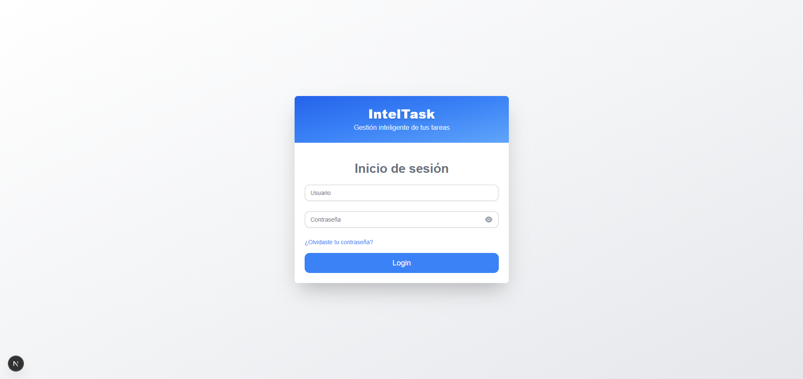

1. **Acceder a la URL del sistema** (proporcionada por su administrador)
2. **Introducir credenciales**:
   - **Usuario**: Su dirección de correo electrónico
   - **Contraseña**: Su contraseña asignada
3. **Hacer clic en "Login"**

#### Características de la Pantalla de Login

- **Diseño Responsivo**: Se adapta a dispositivos móviles y de escritorio
- **Validación en Tiempo Real**: Verifica los campos mientras escribe
- **Botón Mostrar/Ocultar Contraseña**: Para facilitar la escritura
- **Recuperación de Contraseña**: Enlace "¿Olvidaste tu contraseña?"

### Primer Acceso

En su primer acceso, se recomienda:

1. Cambiar la contraseña temporal
2. Verificar la información de perfil
3. Familiarizarse con la interfaz

---
## Módulo de Tareas

### Descripción General

El módulo de tareas permite crear, asignar, hacer seguimiento y completar tareas dentro de la organización. Cada tarea pasa por diferentes estados según su ciclo de vida.

### Estados de las Tareas

1. **📝 Registrado**: Tarea recién creada
2. **👤 Asignado**: Tarea asignada a un usuario
3. **⚙️ En Proceso**: Tarea en desarrollo
4. **⏳ En Espera**: Tarea pausada temporalmente
5. **🔍 En Revisión**: Tarea pendiente de aprobación
6. **❌ Rechazada**: Tarea rechazada por el supervisor
7. **⚠️ Incumplida**: Tarea no completada en tiempo
8. **✅ Terminada**: Tarea completada exitosamente

### Acceso al Módulo de Tareas

1. **Desde el menú principal**, hacer clic en **"Tareas"**
2. **Automáticamente se redirige** a `/tareas`

### Interfaz de Tareas

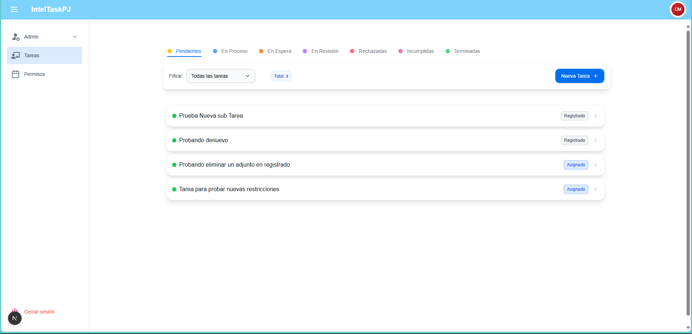

#### Pestañas de Organización

Las tareas se organizan en pestañas según su estado:

- **Pendientes**: Tareas registradas y asignadas
- **En Proceso**: Tareas en desarrollo
- **En Espera**: Tareas pausadas o bloqueadas
- **En Revisión**: Tareas pendientes de revisión
- **Rechazadas**: Tareas rechazadas
- **Incumplidas**: Tareas no completadas a tiempo
- **Terminadas**: Tareas completadas exitosamente

#### Filtros Disponibles

- **Por Rol**: 
  - Todos
  - Como Creador
  - Como Asignado

### Crear Nueva Tarea

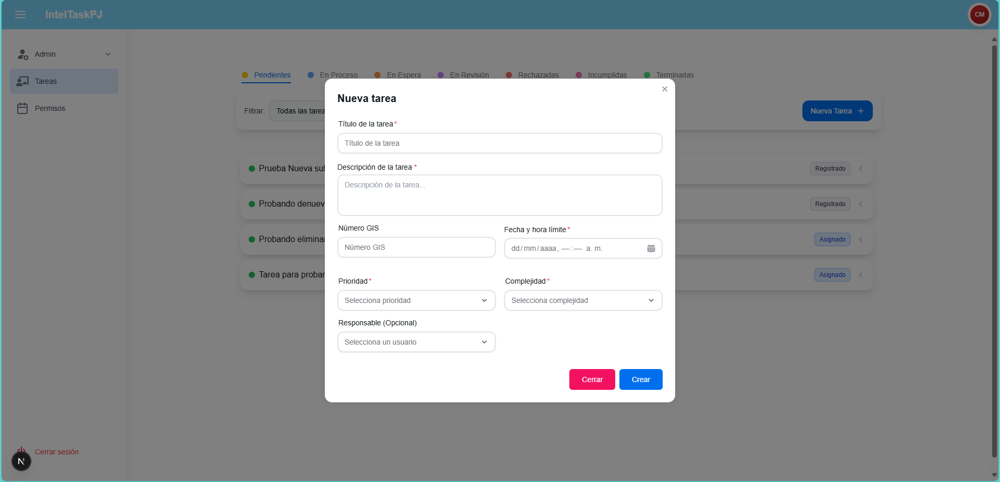

#### Pasos para Crear una Tarea

1. **Hacer clic en el botón "Nueva Tarea"** (ícono ➕)
2. **Completar el formulario** con la siguiente información:

##### Información Básica
- **Título**: Nombre descriptivo de la tarea (obligatorio)
- **Descripción**: Detalles específicos de lo que se debe realizar
- **Usuario Asignado**: Seleccionar de la lista de usuarios disponibles

##### Clasificación
- **Prioridad**: 
  - Muy Baja
  - Baja
  - Media
  - Alta  
  - Muy Alta
- **Complejidad**:
  - Muy Baja
  - Baja
  - Media
  - Alta  
  - Muy Alta

##### Fechas y Plazos
- **Fecha Límite**: Fecha de entrega esperada
- **Fecha de Registro**: Se establece automáticamente

##### Información Adicional
- **Número GIS**: Código de referencia (si aplica)

1. **Hacer clic en "Crear Tarea"**

### Gestionar Tareas Existentes

#### Visualizar Detalles de una Tarea

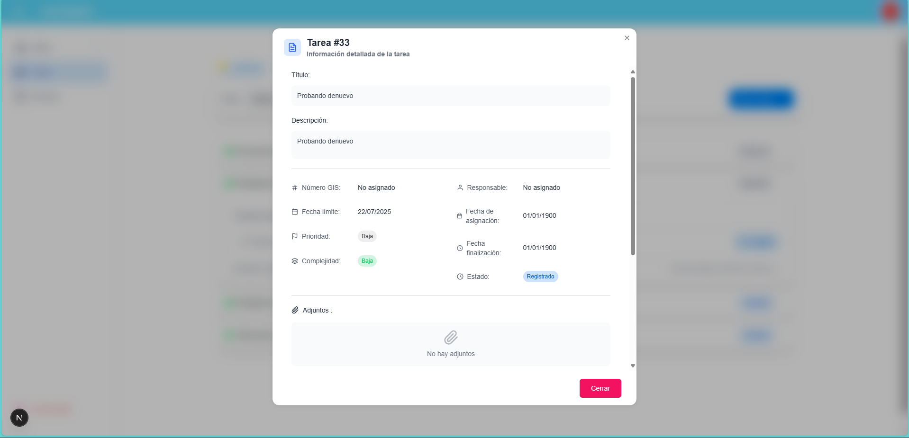

1. **Hacer clic en cualquier tarea** de la lista
2. **Se despliega un acordeón** con información detallada:
   - Información básica
   - Estados y fechas
   - Usuario asignado
   - Archivos adjuntos
   - Historial de cambios

#### Acciones Disponibles

Las acciones disponibles dependen del estado de la tarea y el rol del usuario:

##### Para el Creador de la Tarea
- **Editar**: Modificar información de la tarea
- **Eliminar**: Borrar la tarea (solo en estado "Registrado")
- **Reasignar**: Cambiar el usuario asignado
- **Cambiar Estado**: Mover la tarea a otro estado

##### Para el Usuario Asignado
- **Editar Descripción**: Agregar detalles o comentarios
- **Cambiar Estado**: Actualizar el progreso
- **Subir Adjuntos**: Agregar documentos relevantes
- **Agregar Seguimiento**: Registrar avances

#### Editar una Tarea

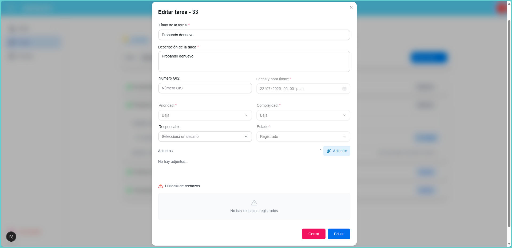

1. **Hacer clic en el botón "Editar"** (ícono ✏️)
2. **Modificar los campos necesarios**
3. **Guardar los cambios**

> **Nota**: Los campos editables varían según el estado de la tarea y el rol del usuario.

#### Cambiar Estado de una Tarea

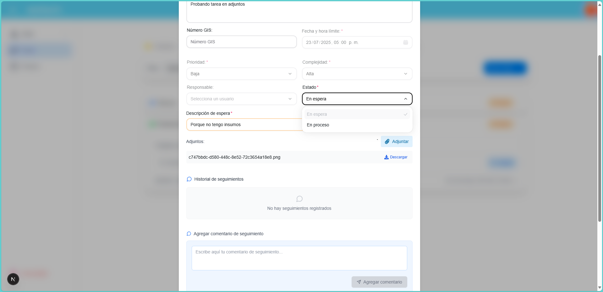

1. **Abrir el modal de edición**
2. **Seleccionar el nuevo estado** del menú desplegable
3. **Agregar comentarios** si es necesario (especialmente para estados como "En Espera" o "Rechazada")
4. **Confirmar el cambio**

### Gestión de Subtareas

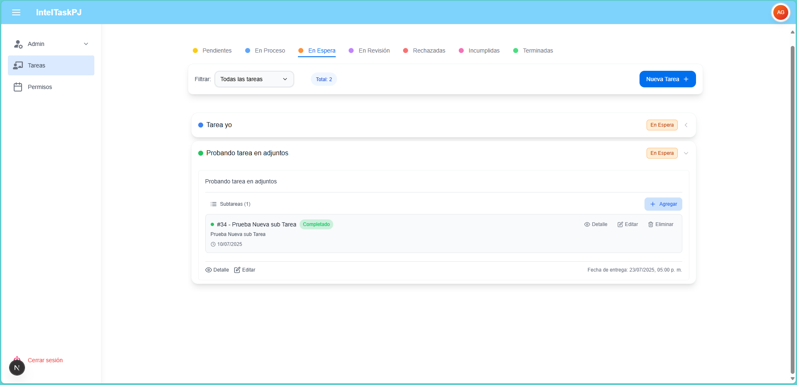

#### Crear Subtareas

1. **Dentro del detalle de una tarea**, hacer clic en "Agregar Subtarea"
2. **Escribir la descripción** de la subtarea
3. **Presionar "Agregar"**

#### Gestionar Subtareas
- **Editar**: Hacer clic en el ícono de edición
- **Eliminar**: Hacer clic en el ícono de basura

### Seguimiento y Comentarios

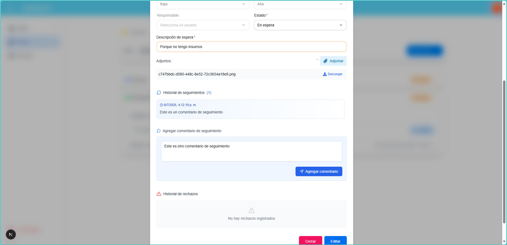

#### Agregar Seguimiento

1. **En el detalle de la tarea**, ir a la sección "Seguimientos"
2. **Escribir el comentario** en el campo de texto
3. **Hacer clic en "Agregar Seguimiento"**

#### Visualizar Historial

- **Historial de Estados**: Ver todos los cambios de estado
- **Seguimientos**: Comentarios y actualizaciones
- **Historial de Rechazos**: Motivos de rechazos anteriores
- **Historial de Incumplimientos**: Registro de incumplimientos

---

## Módulo de Permisos

### Descripción General

El módulo de permisos permite a los empleados solicitar permisos laborales y a los supervisores aprobar o rechazar dichas solicitudes.

### Estados de los Permisos

1. **📝 Registrado**: Permiso recién solicitado
2. **✅ Aprobado**: Permiso aprobado por el supervisor
3. **❌ Rechazado**: Permiso rechazado con justificación

### Acceso al Módulo de Permisos

1. **Desde el menú principal**, hacer clic en **"Permisos"**
2. **Automáticamente se redirige** a `/permisos`

### Interfaz de Permisos

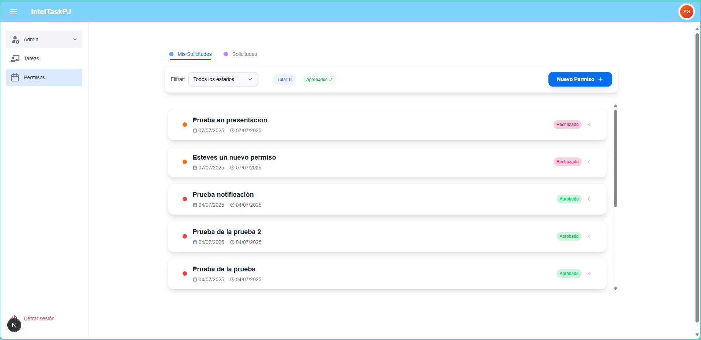

#### Pestañas de Organización

- **Mis Solicitudes**: Permisos que el usuario ha solicitado
- **Solicitudes**: Permisos pendientes de revisión (solo para supervisores)

#### Filtros por Estado

- Todos los estados
- Registrado
- Aprobado
- Rechazado

### Solicitar Nuevo Permiso

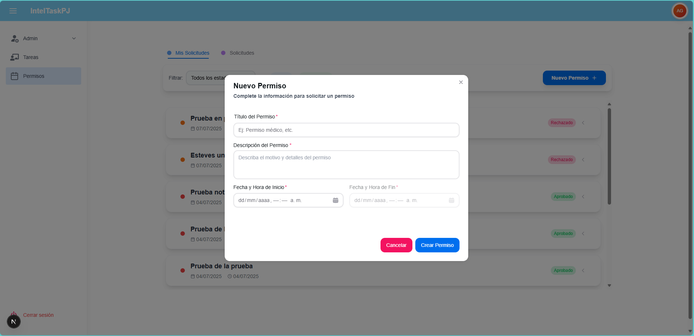

#### Pasos para Solicitar un Permiso

1. **Hacer clic en "Nuevo Permiso"** (botón ➕)
2. **Completar el formulario**:

##### Información del Permiso
- **Título**: Tipo o motivo del permiso (obligatorio)
- **Descripción**: Detalles específicos del permiso solicitado (obligatorio)

##### Fechas y Horarios
- **Fecha y Hora de Inicio**: Cuándo comienza el permiso
- **Fecha y Hora de Fin**: Cuándo termina el permiso

> **Restricciones de Horario**:
> - Solo días hábiles (Lunes a Viernes)
> - Horario permitido: 7:00 AM - 4:30 PM
> - No se permiten fines de semana

3. **Hacer clic en "Crear Permiso"**

### Gestionar Permisos

#### Visualizar Detalles de un Permiso

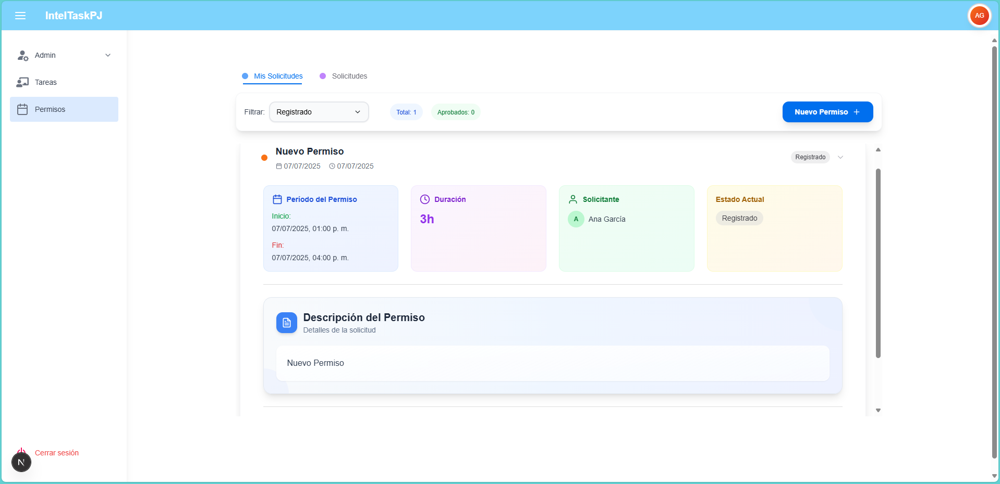

1. **Hacer clic en cualquier permiso** de la lista
2. **Se muestra información detallada**:
   - Fechas del permiso
   - Duración calculada
   - Estado actual
   - Descripción completa
   - Solicitante
   - Motivo de rechazo (si aplica)

#### Acciones Disponibles

##### Para el Solicitante
- **Editar**: Modificar permiso en estado "Registrado"
- **Eliminar**: Borrar permiso en estado "Registrado"
- **Ver Adjuntos**: Acceder a documentos relacionados

##### Para el Supervisor
- **Revisar**: Aprobar o rechazar el permiso
- **Ver Adjuntos**: Acceder a documentos relacionados

#### Aprobar/Rechazar Permisos (Solo Supervisores)

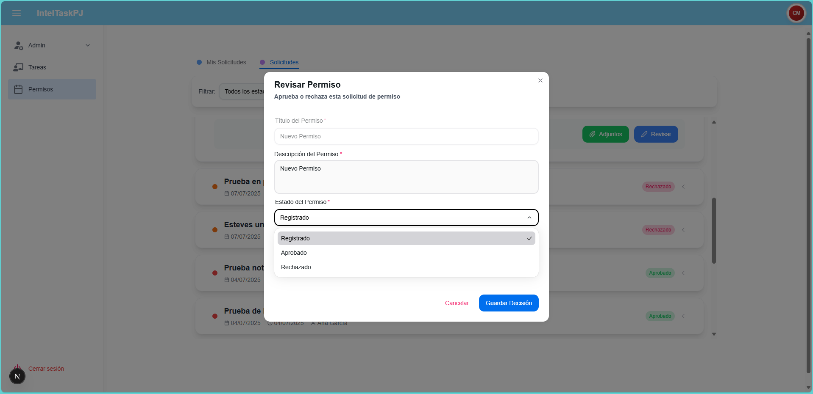

##### Para Aprobar un Permiso

1. **Abrir el permiso** desde la pestaña "Solicitudes"
2. **Hacer clic en "Revisar"**
3. **Seleccionar estado "Aprobado"**
4. **Confirmar la decisión**

##### Para Rechazar un Permiso

1. **Abrir el permiso** desde la pestaña "Solicitudes"
2. **Hacer clic en "Revisar"**
3. **Seleccionar estado "Rechazado"**
4. **Escribir la justificación** del rechazo (obligatorio)
5. **Confirmar la decisión**

---

## Gestión de Adjuntos

### Descripción General

Tanto las tareas como los permisos permiten adjuntar documentos para proporcionar información adicional o evidencia.

### Tipos de Archivos Soportados

- **Documentos**: PDF, DOC, DOCX, TXT
- **Imágenes**: JPG, JPEG, PNG, GIF
- **Hojas de Cálculo**: XLS, XLSX
- **Otros**: ZIP, RAR

### Limitaciones

- **Tamaño máximo por archivo**: 10 MB
- **Número de archivos**: Sin límite específico

### Subir Adjuntos

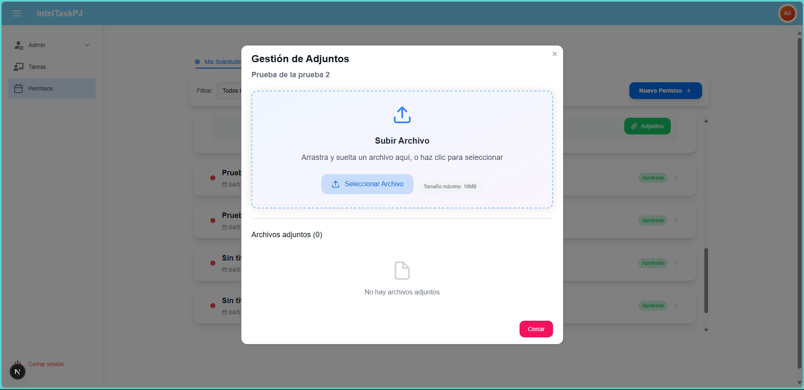

#### Método 1: Arrastrar y Soltar

1. **Abrir el gestor de adjuntos**
2. **Arrastrar el archivo** desde el explorador de archivos
3. **Soltar en la zona indicada**
4. **Esperar a que se complete la subida**

#### Método 2: Seleccionar Archivo

1. **Hacer clic en "Seleccionar Archivo"**
2. **Navegar y seleccionar** el archivo deseado
3. **Confirmar la selección**
4. **Esperar a que se complete la subida**

### Gestionar Adjuntos

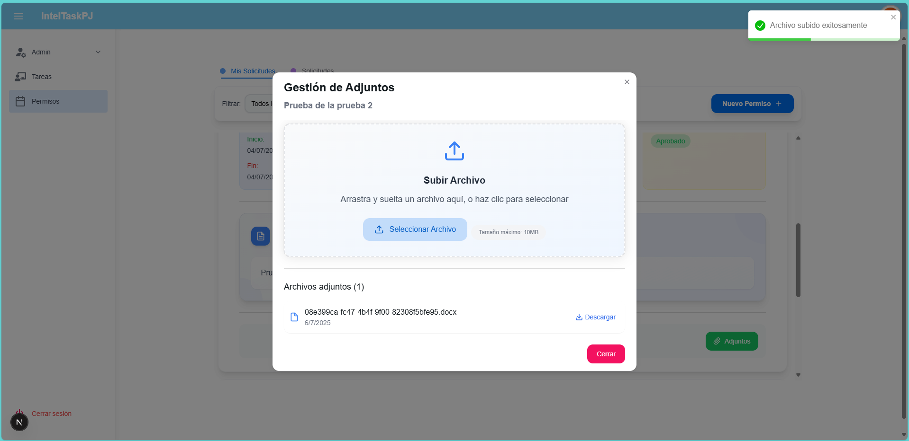

#### Visualizar Adjuntos

- **Lista de archivos**: Muestra nombre, fecha de subida y tamaño
- **Iconos por tipo**: Diferentes iconos según el tipo de archivo
- **Información del usuario**: Quién subió cada archivo

#### Descargar Adjuntos

1. **Hacer clic en "Descargar"** junto al archivo deseado
2. **El archivo se descarga** automáticamente

#### Eliminar Adjuntos

> **Permisos requeridos**: Solo quien subió el archivo puede eliminarlo

1. **Hacer clic en el ícono de basura** (🗑️)
2. **Confirmar la eliminación**

### Restricciones por Estado

#### Para Tareas
- **Registrado**: Solo el creador puede agregar/eliminar adjuntos
- **Otros estados**: Según permisos específicos del usuario

#### Para Permisos
- **Registrado**: Solo el creador puede agregar/eliminar adjuntos
- **Aprobado**: Solo el creador puede agregar adjuntos (no eliminar)
- **Rechazado**: No se pueden modificar adjuntos

---

## Notificaciones

### Sistema de Notificaciones por Email

IntelTask envía notificaciones automáticas por correo electrónico para mantener informados a los usuarios sobre cambios importantes.

### Tipos de Notificaciones

#### Para Tareas

- **Nueva Asignación**: Cuando se asigna una tarea
- **Cambio de Estado**: Cuando cambia el estado de una tarea
- **Proximidad a Vencimiento**: Recordatorios antes de la fecha límite
- **Incumplimiento**: Cuando una tarea no se completa a tiempo

#### Para Permisos

- **Nueva Solicitud**: Cuando se crea un nuevo permiso (a supervisores)
- **Permiso Aprobado**: Confirmación de aprobación
- **Permiso Rechazado**: Notificación con motivo del rechazo

### Configuración de Notificaciones

Las notificaciones se envían automáticamente a la dirección de correo electrónico registrada en el sistema. No requieren configuración adicional por parte del usuario.

### Contenido de las Notificaciones

Cada notificación incluye:

- **Asunto descriptivo**: Identifica claramente el tipo de notificación
- **Información detallada**: Datos relevantes del elemento (tarea/permiso)
- **Enlace directo**: Para acceder rápidamente al sistema
- **Información del remitente**: Quién realizó la acción

---

## Preguntas Frecuentes

### Generales

**P: ¿Puedo usar IntelTask en mi móvil?**
R: Sí, IntelTask es responsive y se adapta a dispositivos móviles, aunque la experiencia completa se optimiza para computadoras de escritorio.

**P: ¿Mis datos están seguros?**
R: Sí, IntelTask implementa medidas de seguridad estándar incluyendo autenticación segura y control de acceso basado en roles.

**P: ¿Puedo trabajar offline?**
R: No, IntelTask requiere conexión a internet para funcionar correctamente.

### Tareas

**P: ¿Puedo asignar una tarea a múltiples usuarios?**
R: No, cada tarea se asigna a un usuario específico, pero se pueden crear subtareas para distribuir el trabajo.

**P: ¿Qué pasa si no completo una tarea a tiempo?**
R: La tarea se marca como "Incumplida" y se envían notificaciones correspondientes.

**P: ¿Puedo cambiar la fecha límite de una tarea?**
R: Sí, si tienes permisos de edición y la tarea está en un estado editable.

**P: ¿Cómo sé el progreso de mis tareas asignadas?**
R: Puedes usar la pestaña "En Proceso" y agregar seguimientos regulares.

### Permisos

**P: ¿Cuánto tiempo toma aprobar un permiso?**
R: Depende de la disponibilidad del supervisor. El sistema envía notificaciones automáticas para acelerar el proceso.

**P: ¿Puedo solicitar permisos para fines de semana?**
R: No, el sistema solo permite horarios laborales (Lunes a Viernes, 7:00 AM - 4:30 PM).

**P: ¿Qué pasa si mi permiso es rechazado?**
R: Recibirás una notificación con el motivo del rechazo. Puedes crear una nueva solicitud corrigiendo los aspectos señalados.

**P: ¿Puedo cancelar un permiso ya aprobado?**
R: No directamente. Debes contactar a tu supervisor para gestionar la cancelación.

### Adjuntos

**P: ¿Qué tipos de archivos puedo subir?**
R: Documentos (PDF, DOC, DOCX), imágenes (JPG, PNG), hojas de cálculo (XLS, XLSX) y archivos comprimidos (ZIP, RAR).

**P: ¿Puedo subir múltiples archivos a la vez?**
R: Actualmente, el sistema permite subir un archivo por vez, pero puedes repetir el proceso para múltiples archivos.

**P: ¿Los adjuntos se eliminan si borro una tarea/permiso?**
R: Sí, al eliminar una tarea o permiso, todos sus adjuntos se eliminan permanentemente.

---
### Versión 1.0 (Julio 2025)
- Manual inicial completo
- Documentación de módulos de Tareas y Permisos
- Guías de usuario paso a paso

---

**© 2025 IntelTask. Todos los derechos reservados.**

*Este manual está sujeto a actualizaciones periódicas. La versión más reciente siempre estará disponible en el sistema.*
